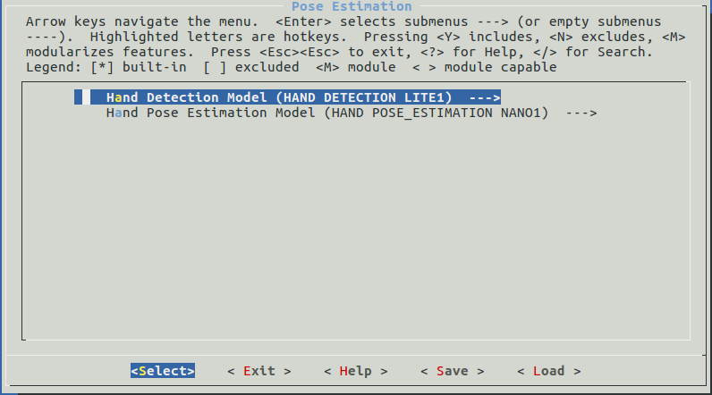

#  Hand Pose Estimation

Hand pose estimation task consists of two parts: hand detection and hand landmarks regression. The hand detection model is used to detect the position of the hand, and the hand landmarks regression model is used to obtain the coordinates of the 21 joint points of the hand. With the hand position and hand joint point coordinates, you can estimate the hand pose.

## API Introduction

```c
hd_config_t hd_init_config();
```

This `hd_init_config()` helps to set and return a **configuration** of hand detection models.

The output is:

- A `hd_config_t` type value which is the configuration of hand detection models.


```c
od_box_array_t *hand_detection_forward(dl_matrix3du_t *image, hd_config_t hd_config);
```

This `hand_detection_forward()` handles the whole hand detection mission.

The inputs are:

- **image**: an image in `dl_matrix3du_t` type.
- **hd_config**: the configuration of hand detection models. 

The output is:

- A `od_box_array_t` type value contains object boxes, as well as score and class of each box.

This structure is defined as follows:

```c
typedef struct tag_od_box_list
{
  fptp_t *score;
  qtp_t *cls;
  box_t *box;
  int len;
} od_box_array_t;
```

The structure contains heads of arrays, each array has a same length, which is the number of objects in the image.


```c
dl_matrix3d_t *handpose_estimation_forward(dl_matrix3du_t *image, od_box_array_t *od_boxes, int target_size);
```

This `handpose_estimation_forward()` handles the whole hand landmarks regression mission.

The inputs are:

- **image**: an image in `dl_matrix3du_t` type.
- **od_boxes**: The output of the hand detection task.
- **target_size**: The input size of hand landmarks regression network.

The output is:

- A `dl_matrix3d_t` type value contains the coordinates of 21 landmarks on the input image for each hand, the size is (n, 1, 21, 2).


## Model Selection

Hand detection:

- HAND DETECTION NANO1
- HAND DETECTION LITE1

Hand landmark regression:

- HAND POSE_ESTIMATION NANO1
- HAND POSE_ESTIMATION LITE1


### Performance

We evaluated all models with the default configuration and our own test set.

|                            | Average Time Consumption (ms) |
| :------------------------: | :---------------------------: |
|    HAND DETECTION NANO1    |             198               |
|    HAND DETECTION LITE1    |             418               |
| HAND POSE_ESTIMATION NANO1 |             408               |
| HAND POSE_ESTIMATION LITE1 |             1480              |


### How to select

Models can be selected through `idf.py menuconfig` or `make menuconfig`. Select `Component config` >>  `ESP-FACE Configuration` >>  `Pose Estimation` sequentially, you'll see options below.

